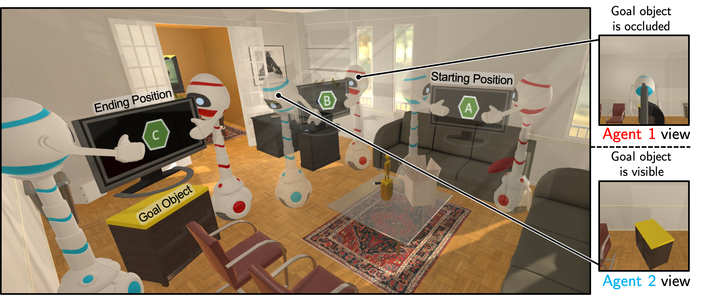
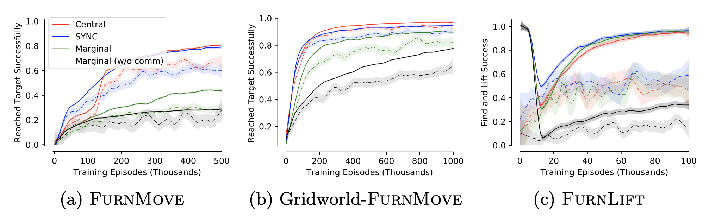
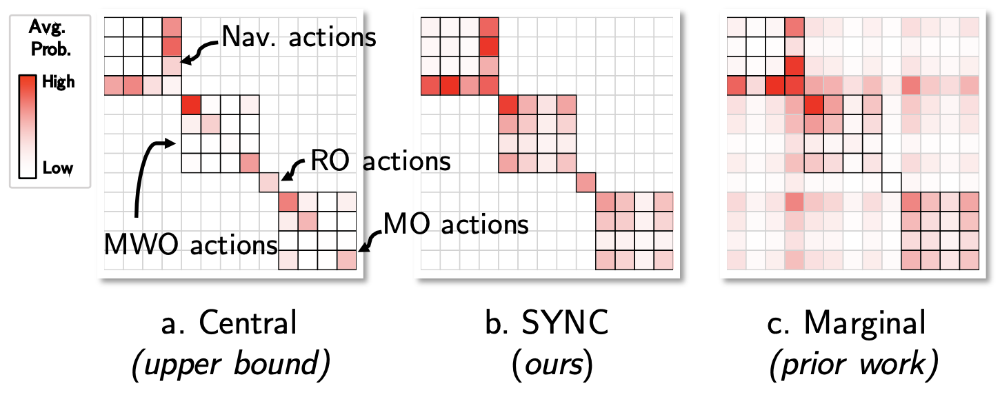
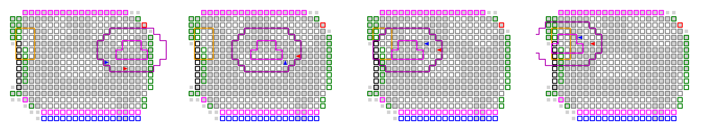
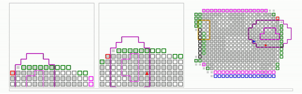
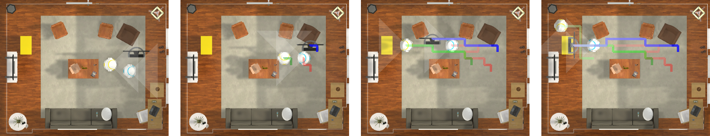

# cordial-sync

This codebase can be used to reproduce the results from our paper, 
[A Cordial Sync: Going Beyond Marginal Policies for Multi-Agent Embodied Tasks](https://unnat.github.io/cordial-sync/)
accepted to the [2020 European Conference on Computer Vision](https://eccv2020.eu/) (ECCV'20). For any
concerns or questions, please either create a GitHub issue (preferred) or reach out
to one of the joint first-authors on the above paper. 

We also include useful code for our previous work on collaborative
embodied agents - [Two Body Problem](https://prior.allenai.org/projects/two-body-problem) (CVPR'19).



## Table of contents

1. [Installation](#installation)
1. [Running a FurnMove experiment](#running-a-furnmove-experiment)
1. [Reproducing plots and tables](#reproducing-plots-and-tables)
1. [Code structure](#code-structure)
1. [Additional information](#additional-information)


## Installation

The following will describe how you may install all python dependencies as well as how
to download our custom [AI2-THOR](https://github.com/allenai/ai2thor) build and model checkpoints.
While downloading model checkpoints is optional, downloading our AI2-THOR build is required to
enable the FurnMove and FurnLift tasks. 

Begin by cloning this repository to your local machine and moving into the top-level directory.

This library has been tested **only in python 3.6**, the following assumes you have a working
version of **python 3.6** installed locally. In order to install requirements we recommend
using [`pipenv`](https://pipenv.kennethreitz.org/en/latest/) but also include instructions if
you would prefer to install things directly using `pip`.

### Installing python dependencies

#### Installing requirements with `pipenv` (*recommended*)

If you have already installed [`pipenv`](https://pipenv.kennethreitz.org/en/latest/), you may
run the following to install all requirements.

```bash
pipenv install --skip-lock
```

This should an automatically fix any dependencies and give an output like:
```bash
$ pipenv install --skip-lock
Removing virtualenv (/Users/USERNAME/.local/share/virtualenvs/cordial-sync-TKiR-u2H)…
Creating a virtualenv for this project…
Pipfile: /PATH/TO/DIR/cordial-sync/Pipfile
Using /usr/bin/python3 (3.6.10) to create virtualenv…
⠹ Creating virtual environment...Using base prefix '/usr'
New python executable in /SOME/PATH/virtualenvs/cordial-sync-TKiR-u2H/bin/python3
Also creating executable in /SOME/PATH/virtualenvs/cordial-sync-TKiR-u2H/bin/python
Installing setuptools, pip, wheel...
done.
Running virtualenv with interpreter /usr/bin/python3

✔ Successfully created virtual environment!
Virtualenv location: /SOME/PATH/virtualenvs/new-mathor-TKiR-u2H
Installing dependencies from Pipfile…
An error occurred while installing torch~=1.1.0! Will try again.
An error occurred while installing tensorboardx! Will try again.
An error occurred while installing tables! Will try again.
  🐍   ▉▉▉▉▉▉▉▉▉▉▉▉▉▉▉▉▉▉▉▉▉▉▉▉▉▉▉▉▉▉▉▉ 29/29 — 00:02:56
Installing initially failed dependencies…
  ☤  ▉▉▉▉▉▉▉▉▉▉▉▉▉▉▉▉▉▉▉▉▉▉▉▉▉▉▉▉▉▉▉▉ 3/3 — 00:01:47
To activate this project's virtualenv, run pipenv shell.
Alternatively, run a command inside the virtualenv with pipenv run.
```

You may need to run this command twice to ensure everything is installed properly.

#### Installing requirements with `pip`

Note: *do not* run the following if you have already installed requirements with `pipenv`
as above. If you prefer using `pip`, you may install all requirements as follows

```bash
pip install -r requirements.txt
```

Depending on your machine configuration, you may need to use `pip3` instead of `pip` in the
above.

### Downloading data

To reproduce our results and run new experiments you will need to download our custom AI2-THOR build, 
model checkpoints, and evaluation data. We have included a helper script that will download these files
and extract them into the appropriate directories. To run this script simply run the following two
lines from within the top-level project directory

```bash
export PYTHONPATH=$PYTHONPATH:$PWD
python rl_multi_agent/scripts/download_evaluation_data.py
```

If you would prefer to download these files manually, or are interested in what is being downloaded, 
please see the following three sections.

#### Downloading our AI2-THOR build

_You should not need to do the following if you have successfully run the `download_evaluation_data.py` script._

To run our FurnLift and FurnMove experiments, you must download our custom AI2-THOR build. You
can find this build (for MacOSX and Linux) at [this link](https://drive.google.com/file/d/1zRbOYb-K07R7Bb1vMBGWdPGqXYY-adMY/view?usp=sharing). Please unzip this directory into
the top-level directory of this project (the path `cordial-sync/ai2thor_builds` should contain
2 files and a directory).

#### Downloading model checkpoints

_You should not need to do the following if you have successfully run the `download_evaluation_data.py` script._

Our model checkpoints can be downloaded at [this link](https://drive.google.com/file/d/1vLckX20fnImvoxugZd812fKi2JVKwC0Z/view?usp=sharing). Please unzip this file and move the contents of the
unzipped folder (this should be the two directories `final_furnlift_ckpts` and `final_furnmove_ckpts`)
into the `trained_models` directory of this project. These two directories contain all final model checkpoints
for our FurnLift and FurnMove experiments. 

#### Downloading evaluation data

_You should not need to do the following if you have successfully run the `download_evaluation_data.py` script._

While not necessary to begin using our codebase, if you would like to reproduce the plots from our paper
(or evaluate your model on the same test set that we use) you will need to download [this link](https://drive.google.com/file/d/1iz_zV74ZIdZd9UwYDvomKPRgqwpPctEi/view?usp=sharing). Extract the contents to `data` directory into the top-level directory of this project (this will overwrite)
the empty data directory that already exists when cloning this repository.

## Running a FurnMove experiment

All FurnMove (and FurnLift) experiment config files can be found in the `rl_multi_agent/experiments`
directory. As an example, let's say we wish to train two agents to complete the FurnMove task and, 
furthermore, we wish to use agents with a CORDIAL loss and SYNC policies. The experimental configuration
for this can be found in the file `rl_multi_agent/experiments/furnmove_vision_mixture_cl_rot_config.py`.
To beginning training for a total of 1e6 episodes with 

* 2 GPUs (with IDs 0 and 1),
* 2 workers,
* Using amsgrad,
* Backproping gradients every 50 steps, and
* Saving checkpoints every 5000 training episodes

we should run the command
```bash
python rl_multi_agent/main.py --task furnmove_vision_mixture_cl_rot --experiment_dir rl_multi_agent/experiments --gpu_ids 0 1 --amsgrad t --workers 2 --num_steps 50 --save_freq 5000 --max_ep 1000000
```

To train a similar model in our gridworld one can simply replace 
`furnmove_vision_mixture_cl_rot` with `furnmove_grid_mixture_cl_rot` in the above. To train the
same (visual) model as above but in the FurnLift task, one can replace `furnmove_vision_mixture_cl_rot`
with `furnlift_vision_mixture_cl`. 

## Reproducing plots and tables

### Evaluating using the released data
Downloading our evaluation data, is the easiest means by which you can quickly reproduce our tables and plots. With the `data/` repository in place the following scripts would come useful:

* `rl_multi_agent/analysis/summarize_furnlift_eval_results.py`
    * Summarize data saved in the `data/furnlift_evaluations__test/` directory, as a result of downloading data or running evaluation using the script `rl_multi_agent/scripts/run_furnmove_or_furnlift_evaluations.py`
* `rl_multi_agent/analysis/summarize_furnmove_eval_results.py`
    * Same as above, except for that this deals with FurnMove data summarization
* `rl_multi_agent/analysis/visualize_furnmove_and_furnlift_log_jsons.py`
    * This script can be used to reproduce the training curves presented in our paper. Note that you might see a user warning for validation set's *TVD* and *Invalid Prob* metrics (which we did not record when training these models initially). If you need them, you can generate them via [evaluating from scratch](Evaluating from scratch).
    
* `rl_multi_agent/analysis/visualize_furnmove_time_averaged_policies.py`
    * This script generates joint policy summaries presented in the paper.
    
* `rl_multi_agent/analysis/visualize_gridbased_furnmove_trajectories.py`
    * Gridworld (2-agent) test data is analysed and the
trajectory summaries (4 top-down views, evenly spread over the episode) and selected video
trajectories are saved in `ABS_PATH_TO_ANALYSIS_RESULTS_DIR` i.e. the `analysis_output` directory. Moreover, if the method being analysed is communicative, an audio rendering of the agent's communication is also saved as a MIDI file.
    * An example of trajectory summary is shown below is for SYNC method for Gridworld-FurnMove. Particularly, the test scene `FloorPlan229` for test episode 15 (out of 0-199/scene). The name `FloorPlan229_physics__15__0_44_88_132.png` includes `0_44_88_132` indicating the steps at which the top-down view were recorded. The fact that it goes to `132` (< `250`) also indicates that this episode was successful.
    
    * An example of the video (converted to gif), of the same episode is included below.
    

* `rl_multi_agent/analysis/visualize_visionbased_furnmove_trajectories.py`
    * Analogous to the above but for marginal and SYNC 2-agent methods.
    * Trajectory summary for same test episode for SYNC method for (visual-)FurnMove is shown below.
    
    * The corresponding video (converted to gif), of the same episode is included below.
    
    

### Evaluating from scratch

If you would like to rerun 
all evaluations from scratch (but using our model checkpoints), please see the
documentation for the scripts:

* `rl_multi_agent/scripts/generate_furnlift_starting_locations_for_evaluation.py` 
    * Generates a fixed dataset of agent starting locations to be used during evaluation
        in the FurnLift task.
* `rl_multi_agent/scripts/generate_furnmove_starting_locations_for_evaluation.py`
    * Generates a fixed dataset of agent starting locations to be used during evaluation
        in the FurnMove task.
* `rl_multi_agent/scripts/run_furnmove_or_furnlift_evaluations.py`.
    * Evaluates the FurnMove/FurnLift model checkpoints on the above generated evaluation datasets. [See how to download our checkpoints](Downloading model checkpoints).

If you wish to go even one step further and retrain our models, you will need to follow
the directions in the above [running a FurnMove experiment](#running-a-furnmove-experiment)
section on all of the relevant experiments. Suppose now you have trained a new model 
checkpoint (e.g. `my_great_checkpoint.dat`) using the `rl_multi_agent/experiments/furnlift_vision_central_cl_config.py`
experiment configuration. To evaluate this checkpoint you will now need to edit the 
corresponding evaluation config file (`rl_multi_agent/furnlift_eval_experiments/furnlift_vision_central_cl_config.py`)
so that the `saved_model_path` method will return the path to your checkpoint.

## Code structure

Here we briefly summarize contents of each directory:

* `ai2thor_builds` - We have introduced additional functionality into AI2-THOR to enable our FurnMove and FurnLift 
    tasks. Because of this, one must download our custom AI2-THOR builds to run our experiments. This directory
    should contain these builds.
* `analysis_output` - This directory will store any images, videos, or other files generated when analyzing 
    trained models.
* `data` - This directory contains any static datasets to be used during evaluation or for analysis. E.g. this
    directory will might contain a file listing all agent starting positions to be used during evaluation. We
    recommend downloading, as described above, our saved version of this file instead of attempting to regenerate
    it yourself.  
* `images` - Contains images used for readme.
* `images/action_icons` - Contains icons depicting the FurnMove agent actions. These are used when generating videos.
* `logs` - All training (tensorboard) logs will be saved into this directory.
* `rl_ai2thor` - Classes/methods used to interface with AI2-THOR (and our gridworld variant of AI2-THOR).
* `rl_base` - Basic reinforcement learning abstractions. For instance, the abstract classes `RLAgent`, `Episode`,
    and `MultiAgentEpisode`.
* `rl_multi_agent` - **This is the main directory of interest.** It contains our main training script (`main.py`), 
    modules defining the FurnMove and FurnLift experiments (`furnlift_episodes.py`, `furnmove_episodes.py`),
    and our models (`models.py`). This directory has a number of useful subdirectories as well:
    * `analysis` - A collection of scripts to analyze/visualize our trained models.
    * `scripts` - A number of helper scripts to generate datasets for analysis using our trained models.
    * `experiments` - All training experiment configuration files.
    * `furnlift_eval_experiments` - Experiment configuration files for evaluating trained FurnLift models.
    * `furnmove_eval_experiments` - Experiment configuration files for evaluating trained FurnMove models.
* `trained_models` - A directory where model checkpoints are stored.
* `utils` - A collection of helpful utility functions.
 
## Additional information
### Contributions

If you would like to make such a contributions we recommend first submitting an 
 issue describing your proposed improvement.
 Doing so can ensure we can validate your suggestions before you spend a great deal of time
 upon them. Small (or validated) improvements and bug fixes should be made via a pull request
 from your fork of this repository.
 
### References
This work builds upon the open-sourced [pytorch-a3c](https://github.com/ikostrikov/pytorch-a3c)
 library of Ilya Kostrikov.
 
### Citation
If you use this codebase, please consider citing [Cordial Sync](https://unnat.github.io/cordial-sync/) and [Two Body Problem](https://prior.allenai.org/projects/two-body-problem).

```bibtex
@InProceedings{JainWeihs2020CordialSync,
author = {Jain, Unnat and Weihs, Luca and Kolve, Eric and Farhadi, Ali and Lazebnik, Svetlana and Kembhavi, Aniruddha and Schwing, Alexander G.},
title = {A Cordial Sync: Going Beyond Marginal Policies For Multi-Agent Embodied Tasks},
booktitle = {ECCV},
year = {2020},
note = {first two authors contributed equally},
}
```

```bibtex
@InProceedings{JainWeihs2019TwoBody,
author = {Jain, Unnat and Weihs, Luca and Kolve, Eric and Rastegari, Mohammad and Lazebnik, Svetlana and Farhadi, Ali and Schwing, Alexander G. and Kembhavi, Aniruddha},
title = {Two Body Problem: Collaborative Visual Task Completion},
booktitle = {CVPR},
year = {2019},
note = {first two authors contributed equally},
}
```
